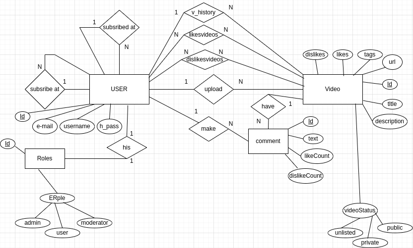
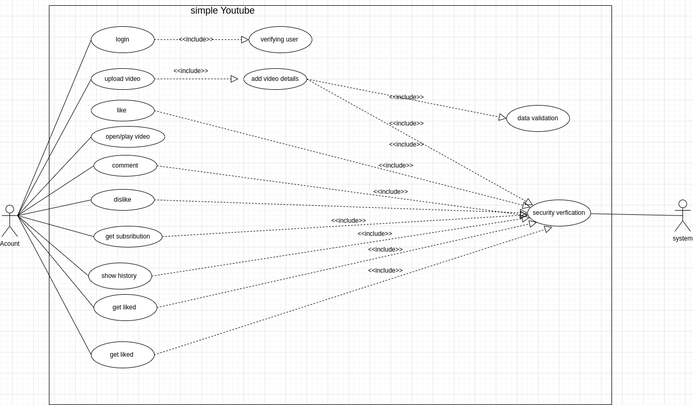

# Youtube-Clone

## database 
##### - Relational Database (mysql || postgresql)
### User Auth (using jwt)
<ul>
<li>login</li>
<li>register</li>
</ul>

### video
<ul>
<li>upload video</li>
<li>getVideoDetails</li>
<li>like Video</li>
<li>dislike video</li>
</ul>

### comment
<ul>
<li>addComment to video</li>
<li>getComments on video</li>
</ul>

### User 
<ul>
<li>getSubscribersCount</li>
<li>chanelsUserSubscribed</li>
</ul>

### ERD for project

### usecase diagram for project

